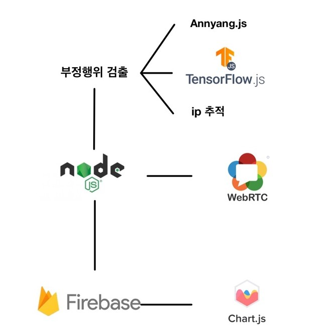
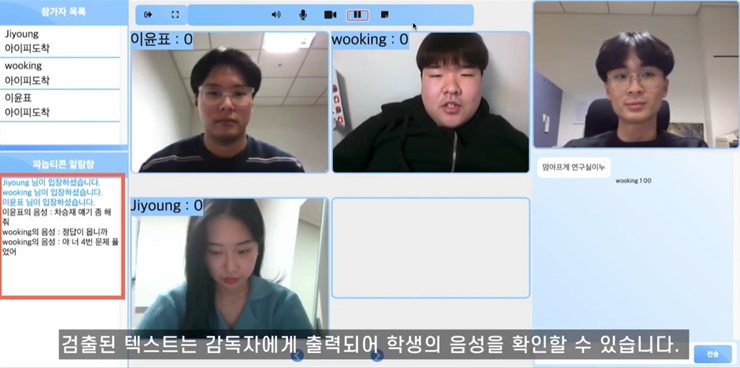
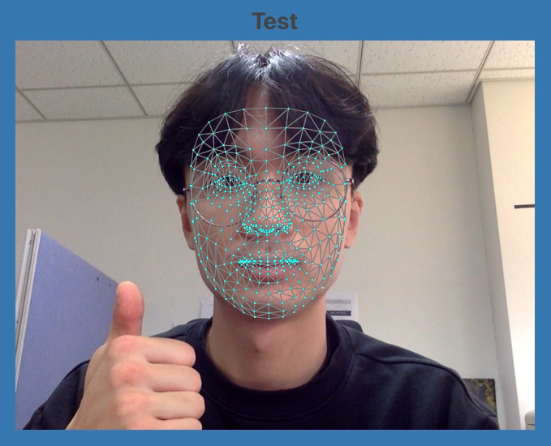

# 동국대학교 2020 겨울 캡스톤 디자인 밸류업 프로그램. Panopticon
## panopticon이란?
부정행위를 방지할 수 있는 비대면 시험 관리감독 플랫폼

2020년 코로나19로 인해 많은 교육 시설이 시험 방식을 비대면으로 전환했다. 갑작스럽게 진행된 비대면 시험은 많은 문제를 야기하였다. 그중 제일 심각한 문제는 '부정행위' 였다. 국내외 많은 대학에서 부정행위가 적발되었고, 그 예로 같은 장소에서 여러 수험자가 응시, 온라인 채팅을 활용한 답안 공유, 시험 대리 응시등 셀 수 없이 많았다.  이러한 문제점은 단순한 교육계의 문제에서 사회적인 이슈로까지 떠오르기도 하였다.  따라서 본 프로젝트는 비대면 시험 부정행위 검출 알고리즘을 개발하고,  이를 적용시킨 화생채팅을 만들어 위와 같은 문제점을 해결해보고자 한다. 
****
## 기술

+ **WEBRTC**   
+ **NodeJS**   
+ **Firebase**   
+ **TensorflowJS**   
+ **AnyangJS**   
+ **GraphJS**
****
## 부정행위 검출
1. annyang.js 를 이용한 stt 와 음량 수험자의 음량을 측정하고 annyang.js 오픈소스를 이용한 음성인식으로 부정행위 검출 
2. tensorflow.js를 이용한 face mesh 수험자의 캠을 통해 들어온 화면은 tensorflow.js에서 제공한 face mesh를 사용하여 얼굴과 동공을 검출한다. 얼굴은 턱의 중앙점과 코의 중앙점, 그리고 미간을 기준으로 고개를 돌렸는지 확인한다.  
3. ip 추적 각 수험자들의 접속 ip를 검출하여 감독자에게 알려준다. 

****
## 사용 화면

****
## 유튜브
* YOUTUBE: <https://www.youtube.com/watch?v=aHYwSKswXYo>

## 참조
* GITHUB : <https://github.com/CSID-DGU/2020-2-OSSP1-WebRTC-6>
****
## 만든 사람들
 
- [x] [qkrwjdan](https://github.com/qkrwjdan) 
- [x] [Jungjjeong](https://github.com/Jungjjeong) 
- [x] [justbeaver97](https://github.com/justbeaver97) 
- [x] [icankok](https://github.com/icankok)
****
